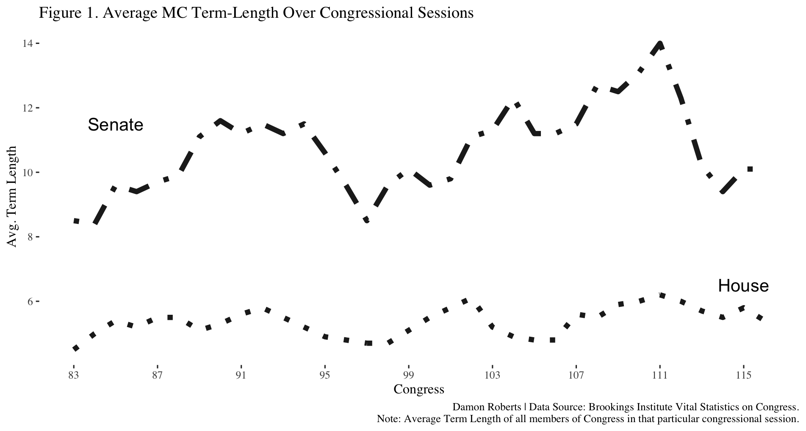
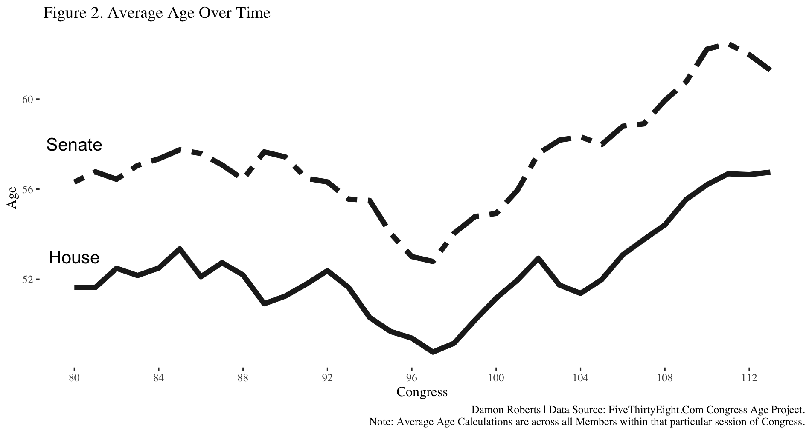
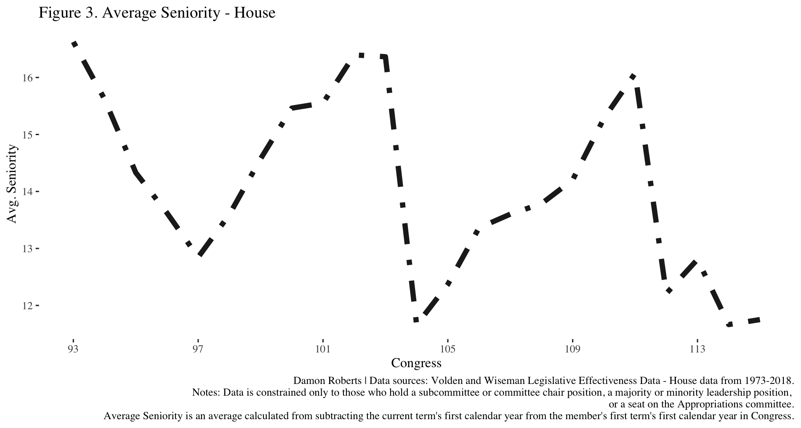

```{r setup, include=FALSE}
options(htmltools.dir.version = FALSE)
```

```{r xaringan-themer, include=FALSE, warning=FALSE}
library(xaringanthemer)
style_duo(primary_color = "#27241D", secondary_color = "#a3f5e6")
```

# The Puzzle:

* Scholars propose that the (now) informal seniority system works as a useful heuristic for the caucus to elect more senior members (see Taylor, 2019)
  * This has a number of assumptions tied to it.
* This project seeks to test whether these assumptions hold and whether the strict definition of a heuristic applies here.

---

# What the Literatue Says

* First, what do caucuses look like in Congress?
  * Some had argued that parties mattered very little in shaping MC behavior (Mayhew 1974; Aldrich 1995, 2011; Krehbiel 1991)
  * Others have argued that they are more powerful (Rohde 1991; Cox and McCubbins 2005)

---

* Second, what motivations to MC's and the collective have?
  * Fenno says that they have three goals:
    * Reelection
    * Achieve more power
    * Good policy
  * Mayhew states that they are primarily concerned with reelection
  * The caucus has goals to ensure that they retain majority status (Rohde 1991)

---

* Third, what does the seniority system look like and what is its utility?
  * Seniority is a good thing in congress - increases information (Krehbiel 1991)
  * Can also build coalitions with seniority to achieve individual goals (Taylor, 2019)

---

* Reasons to believe there are other factors at play here
  * If information is important, we know that MC's satisfice and have a number of opportunities to pool information that isn't entirely related to their time in Congress (Austen-Smith 1993, Hall and Deardorff 2006, McCrain 2018).
  
---

* Reasons to believe there are other factors at play here
  * It doesn't *really* help electorally: 
    * Voters seem to not rally care about relative seniority of their representative (McKelvey and Riezman 1992).
    * Voters look at tangible benefits provided to their district, things that are easy to know where they come from and how they are beneficial to the area (Ansolabehere and Pettigrew 2014).
    * Do not have too much more bargaining power because you are senior (Kellerman and Shepsle 2009).
    * Voters tend to also support those who are ideologically extreme (Utych 2019). Implying more moderate and senior MC's, who may better build bipartisan coalitions, with all else equal, do not benefit electorally.

---

# What I argue

* Seniority can be helpful in many situations but not all. 
* There is some endogeneity here.
* Leadership positions are a bargain (Rubenstein Infinite Horizon Solution Concept)
* Those who provide benefits that are assumed to be perfectly correlated with more experience in Congress can rise to power without being more senior.
  * For example, a young democrat like AOC may signal the Democrat's willingness to embrace young politicians and activists
  * Another example, Lawyers and/or former lobbyists, academics, and policy experts who have relevant and a deep understanding of a particular and relevant area to a policy issue within a committee's jurisdiction
  
---

# Empirically What Does Congress Look Like (Eventual Empirical Analysis)

---



---




---




---

# Questions/Comments?